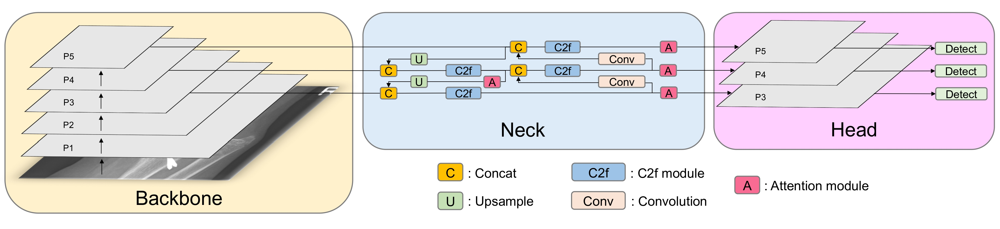
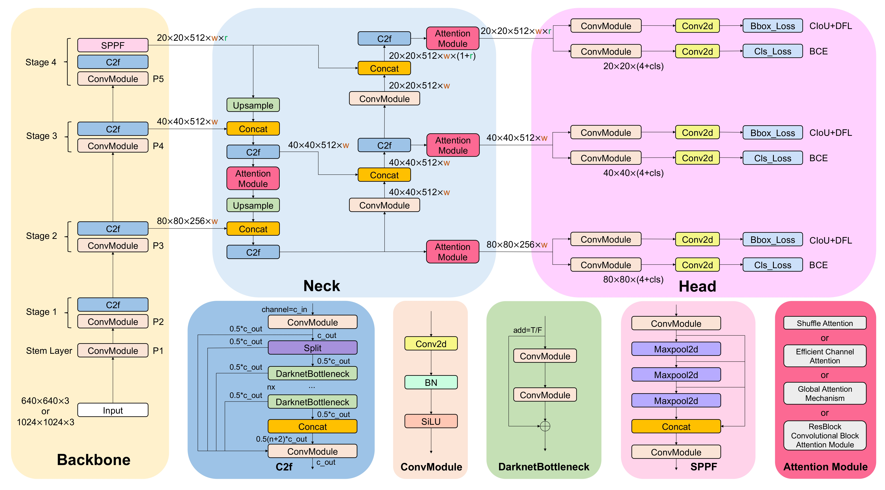
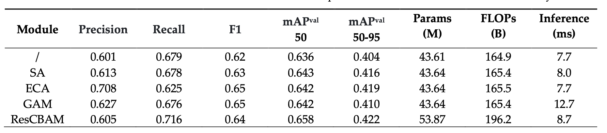

# YOLOv8-AM: YOLOv8 with Attention Mechanisms for Pediatric Wrist Fracture Detection

>[YOLOv8-AM: YOLOv8 with Attention Mechanisms for Pediatric Wrist Fracture Detection](https://arxiv.org/abs/2402.09329)

[](https://paperswithcode.com/sota/object-detection-on-grazpedwri-dx?p=yolov8-am-yolov8-with-attention-mechanisms)

## Abstract
Wrist trauma and even fractures occur frequently in daily life, particularly among children who account for a significant proportion of fracture cases. Before performing surgery, surgeons often request patients to undergo X-ray imaging first and prepare for it based on the analysis of the radiologist. With the development of neural networks, You Only Look Once (YOLO) series models have been widely used in fracture detection as computer-assisted diagnosis (CAD). In 2023, Ultralytics presented the latest version of the YOLO models, which has been employed for detecting fractures across various parts of the body. Attention mechanism is one of the hottest methods to improve the model performance. This research work proposes YOLOv8-AM, which incorporates the attention mechanism into the original YOLOv8 architecture. Specifically, we respectively employ four attention modules, Convolutional Block Attention Module (CBAM), Global Attention Mechanism (GAM), Efficient Channel Attention (ECA), and Shuffle Attention (SA), to design the improved models and train them on GRAZPEDWRI-DX dataset. Experimental results demonstrate that the mean Average Precision at IoU 50 (mAP 50) of the YOLOv8-AM model based on ResBlock + CBAM (ResCBAM) increased from 63.6% to 65.8%, which achieves the state-of-the-art (SOTA) performance. Conversely, YOLOv8-AM model incorporating GAM obtains the mAP 50 value of 64.2%, which is not a satisfactory enhancement. Therefore, we combine ResBlock and GAM, introducing ResGAM to design another new YOLOv8-AM model, whose mAP 50 value is increased to 65.0%.

## Architecture
<p align="center">
  
</p>

## Citation
If you find our paper useful in your research, please consider citing:

    @article{chien2024yolov8am,
      title={YOLOv8-AM: YOLOv8 with Attention Mechanisms for Pediatric Wrist Fracture Detection},
      author={Chien, Chun-Tse and Ju, Rui-Yang and Chou, Kuang-Yi and Chiang, Jen-Shiun},
      journal={arXiv preprint arXiv:2402.09329},
      year={2024}
    }

## Requirements
* Linux (Ubuntu)
* Python = 3.9
* Pytorch = 1.13.1
* NVIDIA GPU + CUDA CuDNN

## Environment
```
  pip install -r requirements.txt
```

## Dataset
### Download the dataset
* You can download the GRAZPEDWRI-DX Dataset on this [Link](https://figshare.com/articles/dataset/GRAZPEDWRI-DX/14825193).
### Split the dataset
* To split the dataset into training set, validation set, and test set, you should first put the image and annotatation into `./GRAZPEDWRI-DX/data/images`, and `./GRAZPEDWRI-DX/data/labels`.
* And then you can split the dataset as the following step:
  ```
    python split.py
  ```
* The dataset is divided into training, validation, and testing set (70-20-10 %) according to the key `patient_id` stored in `dataset.csv`. The script then will move the files into the relative folder as it is represented here below.


       GRAZPEDWRI-DX
          └── data   
               ├── meta.yaml
               ├── images
               │    ├── train
               │    │    ├── train_img1.png
               │    │    └── ...
               │    ├── valid
               │    │    ├── valid_img1.png
               │    │    └── ...
               │    └── test
               │         ├── test_img1.png
               │         └── ...
               └── labels
                    ├── train
                    │    ├── train_annotation1.txt
                    │    └── ...
                    ├── valid
                    │    ├── valid_annotation1.txt
                    │    └── ...
                    └── test
                         ├── test_annotation1.txt
                         └── ...


The script will create 3 files: `train_data.csv`, `valid_data.csv`, and `test_data.csv` with the same structure of `dataset.csv`.
                      
### Data Augmentation
* Data augmentation of the training set using the addWeighted function doubles the size of the training set.
```
  python imgaug.py --input_img /path/to/input/train/ --output_img /path/to/output/train/ --input_label /path/to/input/labels/ --output_label /path/to/output/labels/
```
For example:
```
  python imgaug.py --input_img ./GRAZPEDWRI-DX/data/images/train/ --output_img ./GRAZPEDWRI-DX/data/images/train_aug/ --input_label ./GRAZPEDWRI-DX/data/labels/train/ --output_label ./GRAZPEDWRI-DX/data/labels/train_aug/
```
* The path of the processed file is shown below:

       GRAZPEDWRI-DX
          └── data   
               ├── meta.yaml
               ├── images
               │    ├── train
               │    │    ├── train_img1.png
               │    │    └── ...
               │    ├── train_aug
               │    │    ├── train_aug_img1.png
               │    │    └── ...
               │    ├── valid
               │    │    ├── valid_img1.png
               │    │    └── ...
               │    └── test
               │         ├── test_img1.png
               │         └── ...
               └── labels
                    ├── train
                    │    ├── train_annotation1.txt
                    │    └── ...
                    ├── train_aug
                    │    ├── train_aug_annotation1.txt
                    │    └── ...
                    ├── valid
                    │    ├── valid_annotation1.txt
                    │    └── ...
                    └── test
                         ├── test_annotation1.txt
                         └── ...
  
## Methodology
* We have modified the model architecture of YOLOv8 by adding four types of attention modules, including <b>Shuffle Attention (SA), Efficient Channel Attention (ECA), Global Attention Mechanism (GAM), and ResBlock Convolutional Block Attention Module (ResCBAM)</b>.
<p align="center">
  
</p>
  
## Experiments
### Experimental Results

<p align="center">
  
</p>

### Model Training
* We have provided a training set, test set and validation set containing a single image that you can run directly by following the steps in the example below.
* Before training the model, make sure the path to the data in the `./GRAZPEDWRI-DX/data/meta.yaml` file is correct.
```
  # patch: /path/to/GRAZPEDWRI-DX/data
  path: 'E:/GRAZPEDWRI-DX/data'
  train: 'images/train_aug'
  val: 'images/valid'
  test: 'images/test'
```

* Arguments

You can set the value in the `./ultralytics/cfg/default.yaml`.

| Key | Value | Description |
| :---: | :---: | :---: |
| model | None | path to model file, i.e. yolov8m.yaml, yolov8m_ECA.yaml |
| data | None | path to data file, i.e. coco128.yaml, meta.yaml |
| epochs | 100 | number of epochs to train for, i.e. 100, 150 |
| patience | 50 | epochs to wait for no observable improvement for early stopping of training |
| batch | 16 | number of images per batch (-1 for AutoBatch), i.e. 16, 32, 64 |
| imgsz | 640 | size of input images as integer, i.e. 640, 1024 |
| save | True | save train checkpoints and predict results |
| device | 0 | device to run on, i.e. cuda device=0 or device=0,1,2,3 or device=cpu |
| workers | 8 | number of worker threads for data loading (per RANK if DDP) |
| pretrained | True | (bool or str) whether to use a pretrained model (bool) or a model to load weights from (str) |
| optimizer | 'auto' | optimizer to use, choices=SGD, Adam, Adamax, AdamW, NAdam, RAdam, RMSProp, auto |
| resume | False | resume training from last checkpoint |
| lr0 | 0.01 | initial learning rate (i.e. SGD=1E-2, Adam=1E-3) |
| momentum | 0.937 | 	SGD momentum/Adam beta1 |
| weight_decay | 0.0005 | optimizer weight decay 5e-4 |
| val | True | validate/test during training |

* Example Traning Steps (yolov8m):
```
  python start_train.py --model ./ultralytics/cfg/models/v8/yolov8m.yaml --data_dir ./GRAZPEDWRI-DX/data/meta.yaml
```
* Example Traning Steps (yolov8m_ECA):
```
  python start_train.py --model ./ultralytics/cfg/models/v8/yolov8m_ECA.yaml --data_dir ./GRAZPEDWRI-DX/data/meta.yaml
```
